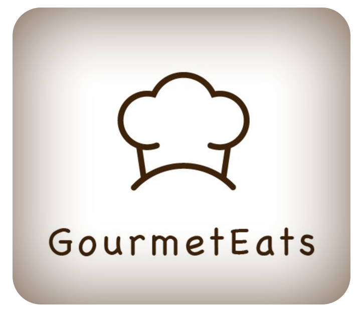
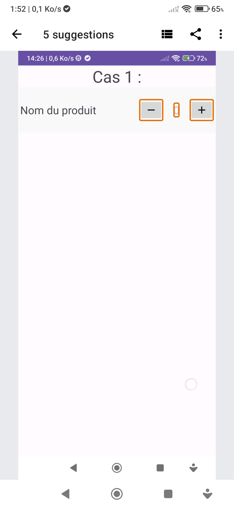
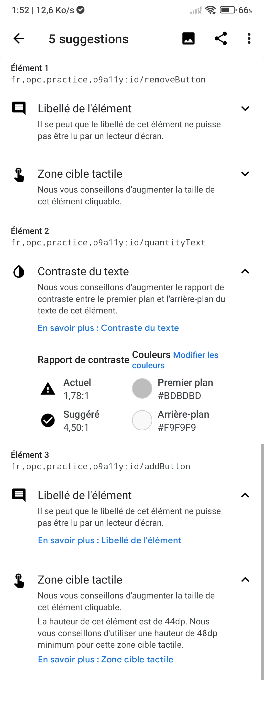
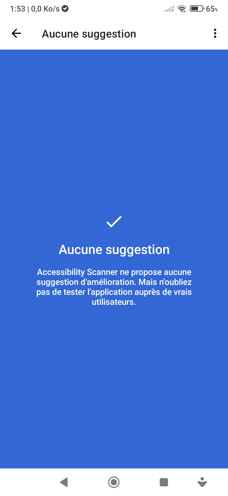
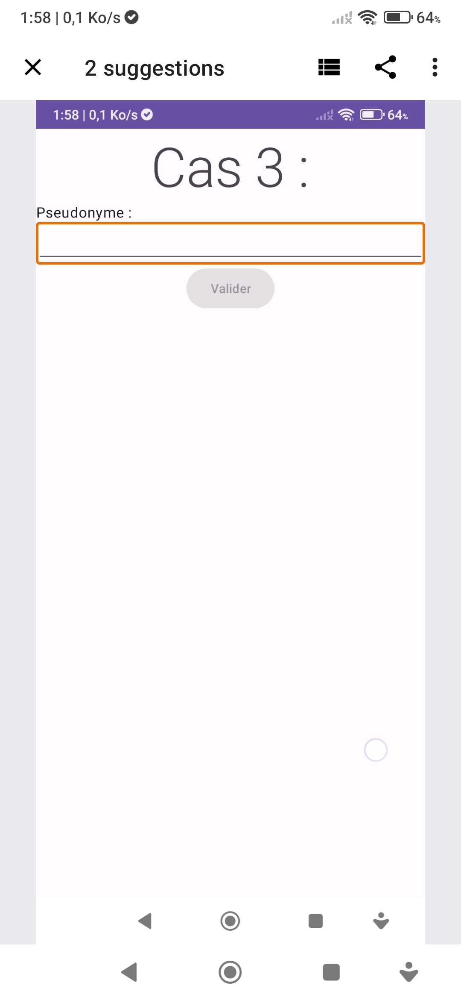
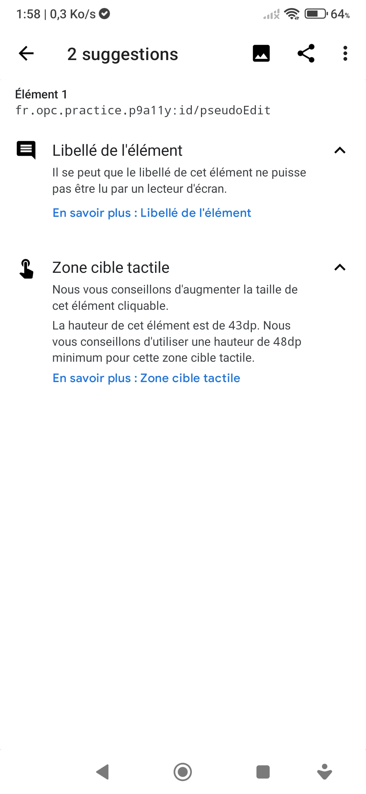

  

# GourmetEats App

Application Android dont l'objectif est d'**améliorer l'accessibilité** pour tous les utilisateurs, y compris les personnes en situation de handicap.

Développée en Kotlin avec une architecture **modulaire**, en respectant les bonnes pratiques Android et les recommandations **WCAG / RGAA**.

---

## 🚀 Présentation du projet

**Contexte** :  
Dans le cadre d’une démarche inclusive, l’application Android doit respecter les normes d’accessibilité numérique afin d’être utilisable avec des outils comme **TalkBack** et de s’adapter aux préférences utilisateurs (taille de texte, contraste, etc.).

**Mission** :  
- Identifier les obstacles à l’accessibilité avec **TalkBack** et **Accessibility Scanner**.
- Appliquer des **correctifs dans le code** (ex: `contentDescription`, `labelFor`, `sp`, `minHeight`, etc.).
- Proposer une **expérience utilisateur accessible** et respectueuse des standards RGAA.
- Améliorer la lisibilité, la navigation et les retours utilisateurs dans différents cas d’usage.
- Réaliser les **tests manuels** et produire une **documentation claire** des améliorations apportées.

---

## ⚙️ Fonctionnalités principales

- Navigation complète **compatible TalkBack**.
- Interface adaptative à la **taille de police personnalisée**.
- Composants avec **descriptions accessibles** (`contentDescription`, `labelFor`…).
- Boutons et champs respectant les tailles et contrastes recommandés.
- Gestion d’éléments dynamiques via `announceForAccessibility()`.

---

## 📈 Tâches réalisées

| Étape | Objectifs | Résultats |
| :--- | :--- | :--- |
| **Analyse d'accessibilité** | Scanner l'application avec TalkBack et Accessibility Scanner | Liste de problèmes identifiés (contraste, absence de description, etc.) |
| **Correction Case 1** | Améliorer l’accessibilité des boutons + / − et des quantités | Ajout de `contentDescription`, feedback vocal avec `announceForAccessibility()` |
| **Correction Case 2** | Rendre une carte de recette totalement accessible | Changement d’image pour meilleur contraste, icône de favoris décrite dynamiquement |
| **Correction Case 3** | Rendre un champ de saisie accessible (label, taille, erreur) | `labelFor`, taille min 48dp, ajout de `autofillHints` et feedback non colorimétrique |
| **Tests manuels** | Vérifier chaque écran en conditions réelles | Tests TalkBack, taille texte, scanner validés sur tous les cas |
| **Documentation** | Structuration claire des correctifs | Ce README + captures & démonstration ajoutées |

---

## 🛠️ Stack technique

- **Langage** : Kotlin
- **UI** : XML + Material Design
- **Accessibilité** : TalkBack, Accessibility Scanner
- **Architecture** : Activité + composants modifiables
- **Tests** : Manuels (sans Espresso)
- **IDE** : Android Studio

---

## 📸 Screenshots

| Case 1 scan | Case 1 report | Case 1 fixed scan |
|:---:|:---:|:---:|
|  |  |  |

| Case 3 scan | Case 3 report | Case 3 fixed scan |
|:---:|:---:|:---:|
|  |  |  |

---

## 🎯 Résultat final

✅ Application compatible avec les principaux outils d'accessibilité.  
✅ Expérience utilisateur inclusive : lisible, navigable, compréhensible.  
✅ Problèmes identifiés résolus avec preuves fonctionnelles.  
✅ Démarche conforme aux référentiels **WCAG**, **RGAA**, et **Material 3**.

---

---
